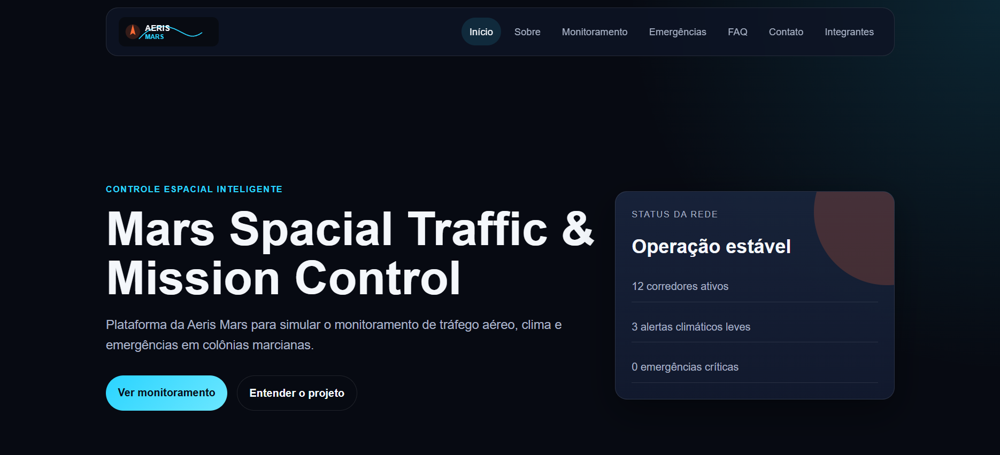
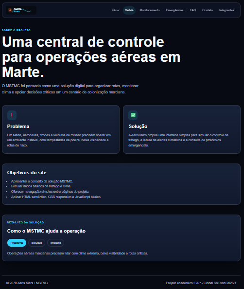
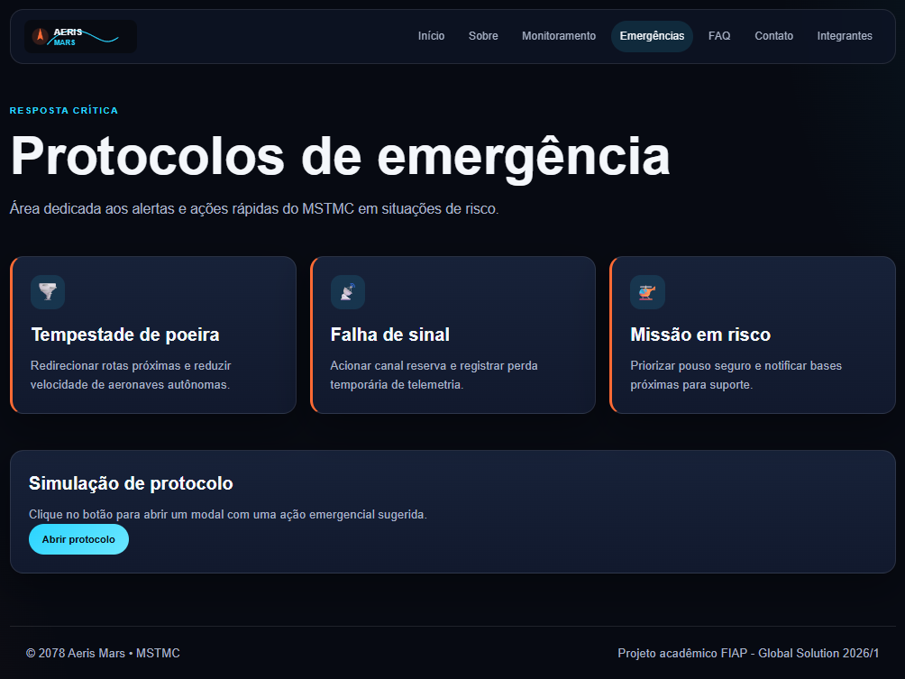
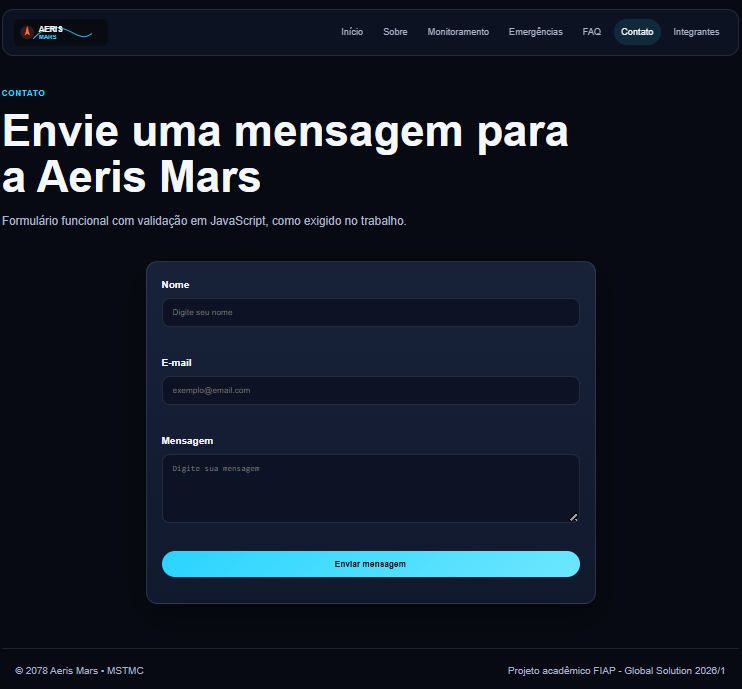
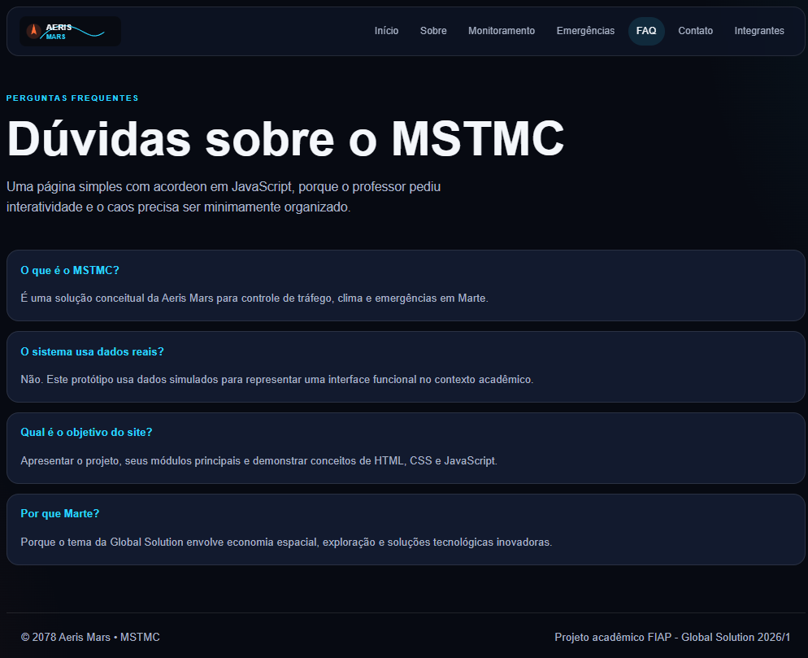
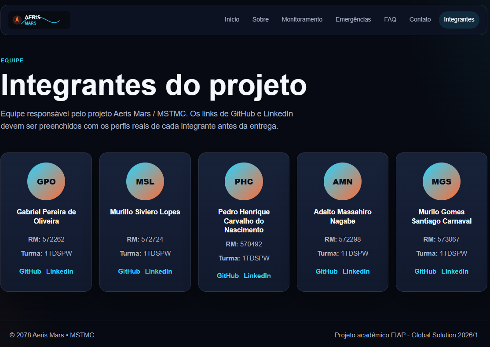

# Aeris Mars - MSTMC

Projeto acadêmico desenvolvido para a Global Solution 2026/1 da FIAP.

## Descrição

O site apresenta a solução **Mars Spacial Traffic & Mission Control (MSTMC)**, uma plataforma conceitual da startup fictícia Aeris Mars para monitoramento de tráfego aéreo marciano, clima e emergências.

O objetivo do projeto é demonstrar uma interface responsiva, navegável e interativa usando apenas HTML, CSS e JavaScript.

## Tecnologias utilizadas

- HTML5
- CSS3
- JavaScript
- Git e GitHub

## Funcionalidades implementadas

- Menu responsivo com botão hambúrguer.
- Navegação completa entre páginas.
- Hero section e grid de cards na página inicial.
- Página de monitoramento com simulação de atualização de dados.
- Página de emergências com modal acessível.
- FAQ em formato de acordeon com atualização de `aria-expanded`.
- Formulário de contato com validação funcional em JavaScript.
- Estrutura de CSS separada entre base, imports e estilos específicos.
- Favicon com caminho correto.
- Imagens concentradas em `assets/images`.

## Estrutura de pastas

```txt
/
├── index.html
├── README.md
├── assets/
│   ├── images/
│   │   ├── logo-aeris-mars.svg
│   │   └── favicon.svg
│   ├── css/
│   │   ├── main.css
│   │   ├── base.css
│   │   ├── index.css
│   │   ├── sobre.css
│   │   ├── monitoramento.css
│   │   ├── emergencias.css
│   │   ├── faq.css
│   │   ├── contato.css
│   │   └── integrantes.css
│   └── js/
│       ├── app.js
│       ├── index.js
│       ├── sobre.js
│       ├── monitoramento.js
│       ├── emergencias.js
│       ├── faq.js
│       ├── contato.js
│       └── integrantes.js
└── pages/
    ├── sobre.html
    ├── monitoramento.html
    ├── emergencias.html
    ├── faq.html
    ├── contato.html
    └── integrantes.html
```

## Organização do CSS

- `main.css`: importa todos os arquivos CSS.
- `base.css`: contém `:root`, variáveis, reset, estilos globais e componentes reutilizáveis.
- Arquivos específicos: contêm apenas estilos próprios de cada página.

## Organização do JavaScript

- `app.js`: contém o menu responsivo usado em todas as páginas.
- `index.js`: interação visual no painel da página inicial.
- `sobre.js`: cards selecionáveis e abas interativas.
- `monitoramento.js`: simulação de dados operacionais.
- `emergencias.js`: abertura e fechamento de modal.
- `faq.js`: acordeon com acessibilidade.
- `contato.js`: validação funcional do formulário.
- `integrantes.js`: interação visual nos cards da equipe.

## Páginas

- `index.html`: página inicial com header, hero section e grid com três cards.
- `pages/sobre.html`: descrição do projeto, problema, solução e abas.
- `pages/monitoramento.html`: página extra da solução com simulação de indicadores.
- `pages/emergencias.html`: página extra da solução com protocolos e modal.
- `pages/faq.html`: perguntas frequentes com acordeon.
- `pages/contato.html`: formulário com validação em JavaScript.
- `pages/integrantes.html`: identificação da equipe.

## Autores e créditos

Preencher com os dados reais:

| Nome                                  | RM       | Turma  | GitHub                                  | LinkedIn                                                        |
| ------------------------------------- | -------- | ------ | --------------------------------------- | --------------------------------------------------------------- |
| Gabriel Pereira de Oliveira           | RM572262 | 1TDSPW | https://github.com/Gabriel-Oliveira0611 | https://www.linkedin.com/in/gabriel-pereira-1aa4bb224/          |
| Murillo Siviero Lopes                 | RM572724 | 1TDSPW | https://github.com/MurilloSLopes        | https://www.linkedin.com/in/murillo-llopes-23out99/             |
| Pedro Henrique Carvalho do Nascimento | RM570492 | 1TDSPW | https://github.com/pedrohcnascimento    | https://www.linkedin.com/in/pedrohenriquecn07/                  |
| Adalto Massahiro Nagabe               | RM572298 | 1TDSPW | https://github.com/AdaltoNagabe         | https://www.linkedin.com/in/adalto-massashiro-nagabe-149685104/ |
| Murilo Gomes Santiago Carnaval        | RM573067 | 1TDSPW | https://github.com/murilossanttiago     | https://www.linkedin.com/in/murilo-gomes-santiago/              |

## Prints / imagens do projeto

- Página inicial.
  
- Página sobre o projeto
  
- Página de monitoramento.
  
- Página de emergências.
  
- Página de contato.
  
- Página de perguntas frequêntes
  
- Página de integrantes.
  

## Link do repositório

https://github.com/Gabriel-Oliveira0611/global-solution-front-end-design-engineering
